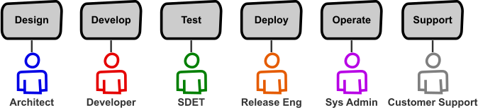
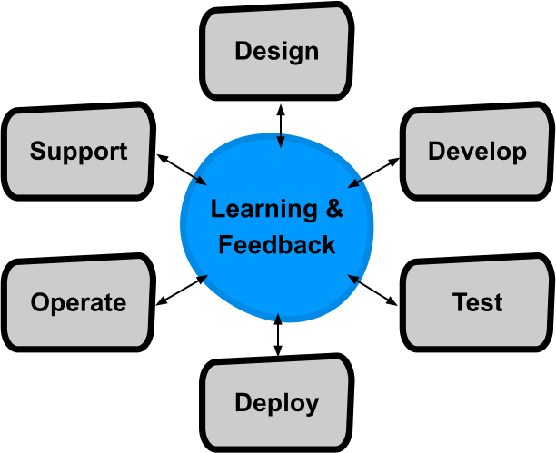
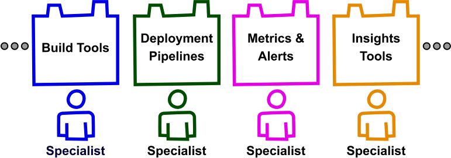
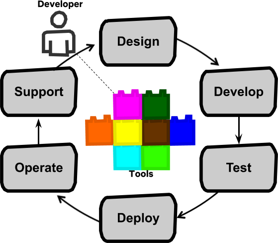
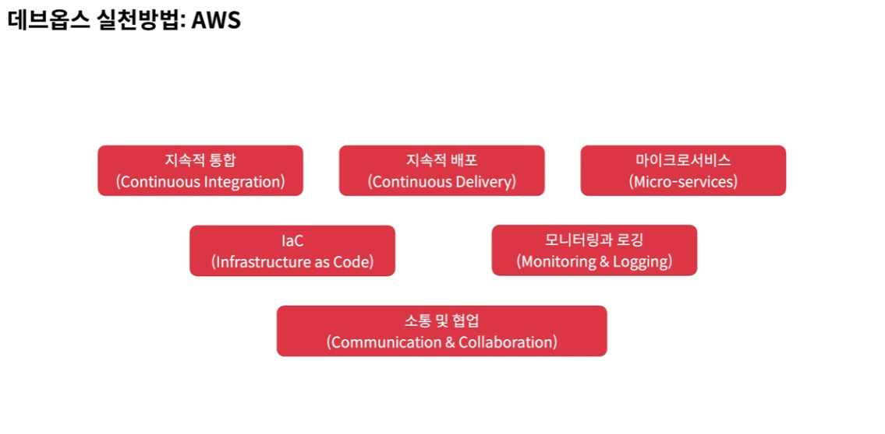

# DevOps 개요

## DevOps 정의

* DevOps = Dev(개발) + Ops(운영)
* 개발과 운영의 경계를 허물고 통합하고자 하는 문화 혹은 철학
* 제품의 변경사항을 품질을 보장함과 동시에 프로덕션에 반영하는데 걸리는 시간을 단축하기 위한 실천 방법의 모음

## DevOps가 필요한 이유

### 넷플릭스 사례

[Full Cycle Developers at Netflix — Operate What You Build](https://netflixtechblog.com/full-cycle-developers-at-netflix-a08c31f83249)

#### 전통적인 SDLC

* SDLC: Software Development Life Cycle
* 소프트웨어 수명 주기의 목적은 "가치 실현 시간"을 최적화하는 것

* 설계 - 개발 - 테스트 - 배포 - 운영 - 지원
* 소프트웨어 규모가 커지면 각 단계별 전문가로 구성된 기능 조직을 운영하게 된다.
* 다음 단계로 진행하기 위해서는 의사소통이 필수적
* 커뮤니케이션 오버헤드가 커지고 병목 구간이 생기기 쉽다.

#### SDLC with DevOps

* 개발자는 작성한 코드에 대해 스스로 테스트하고, 배포하고, 운영에 참여할 수 있다.
* 책임을 외부화하기보다 각 개발 팀에 분배하면 직접적인 피드백 루프가 생성된다.

#### 공통 도구 및 인프라 팀

* 모든 개발팀이 공통적으로 겪는 문제를 해결하기 위한 팀
* 공통 도구 및 인프라 팀은 전문 지식을 재사용 가능한 빌딩 블록으로 전환한다.
* 개발 팀은 특정 제품 도메인 내에서 문제를 해결하는 데 집중할 수 있다.

#### Full-cycle 개발자 모델

* 풀 사이클 개발자: 소프트웨어 개발 생애주기의 전체에 직접 참여하는 개발자
* 수명 주기의 모든 영역에 엔지니어링 원칙을 적용한다.

## DevOps 실천방법

* 개발과 운영의 벽을 허물어 더 빨리 자주 배포한다.

### 지속적 통합(Continuous Integration)

* 개발자가 만든 변경 사항에 대해서 빌드 및 테스트를 진행해본 후 중앙 코드 저장소에 통합을 함으로써 빠르게 버그를 발견하고 제품의 품질을 보장할 수 있게 해주는 소프트웨어 개발 방법

### 지속적 배포(Continuous Delivery)

* 개발 결과 산출물을 자동으로 개발/운영 환경까지 배포하도록 만든 자동화된 파이프라인

### 마이크로서비스(Microservices)

* 커다란 서비스를 여러 마이크로서비스로 쪼개 빌드 타임과 배포 타임을 단축시킬 수 있다.

### IaC(Infrastructure as Code)

* 인프라스트럭처를 코드로 관리하는 기술.
* 인프라 변경사항을 자동화시켜 빠르게 적용하고 관리할 수 있다.

### 모니터링과 로깅(Monitoring & Logging)

* 개발자들에게 제품의 메트릭과 로그 데이터를 중앙에서 확인할 수 있는 환경을 제공함으로써 제품에 문제가 생길 시 개발자가 빠르게 해결할 수 있다.

### 소통 및 협업(Communication & Collaboration)

* 조직내에 소통 및 협업을 개선함으로써 데브옵스 문화를 정착시킬 수 있다.
* 사내 메신저 시스템, 이슈 트래킹 시스템, 위키 시스템 등

### Flickr 사례

#### 변화에 대응하기 위한 도구

* 자동화된 인프라(Automated Infrastructure)
* 버전관리 공유(Shared Version Control)
* 쉬운 빌드 및 배포(One-step Build and Deploy)
* 기능 활성화 스위치(Feature Flag)
* 메신저 봇(IRC and IM Robot)

#### 변화에 대응하기 위한 문화

* 존중(Respect)
* 신뢰(Trust)
* 실패에 대한 긍정적인 자세(Healthy Attitude about Failure)
* 비난하지 않기(Avoiding Blame)

## 요약

* 데브옵스는 개발과 운영을 통합하여 제품 출시 및 조직의 효율성을 끌어올리기 위한 문화이다.
* 데브옵스는 기업의 소프트웨어 개발 방법을 개선하기위한 움직임이다.
* 데브옵스는 조직, 고객, 회사 모두에 이점을 가져다 줄 수 있다.
* 데브옵스는 자체적으로 방법을 제시하지는 않지만, 여러 실천 방법들을 활용할 수 있다.
