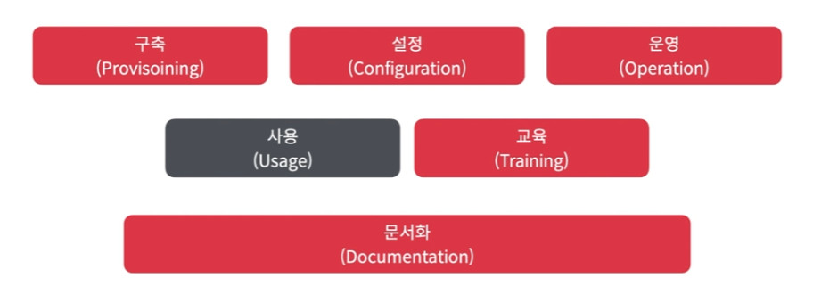

# DevOps 엔지니어의 역할

## DevOps VS DevOps 엔지니어

* 데브옵스 엔지니어는 조직에 데브옵스 문화를 정착시키는데 도움을 주는 역할이다.
* 데브옵스 엔지니어는 개발자가 개발 뿐만 아니라 운영에도 참여할 수 있는 환경을 만들어준다.
  * 데브옵스 팀의 고객: 개발자
  * 데브옵스 팀의 목표: 개발자의 생산성을 극대화하는 것
* 데브옵스 엔지니어는 업무 도메인이 세분화 된 팀들로 구성될 수 있다.

## DevOps 팀의 업무 도메인 (문제 단위)

### 네트워크(Network)

* 가상 네트워크 및 물리 네트워크 구성
* 프록시 / VPN 서버 운영
* DNS 서버 운영

### 개발 및 배포 플랫폼(Development & Deployment Platform)

* GitLab / GitHub과 같은 버전 관리 및 개발 협업 플랫폼 운영
* CI / CD 파이프라인 시스템 구축 및 운영
* QA 테스트 및 성능 테스트를 위한 환경 제공
* 패키지 저장소 운영 및 배포 산출물 관리

### 오케스트레이션 플랫폼(Orchestration Platform)

* 쿠버네티스 / ECS / Nomad와 같은 오케스트레이션 시스템 구축 및 운영
* Airflow / Argo Workflows와 같은 워크플로우 엔진 구축 및 운영

### 관측 플랫폼(Observability Platform)

* 로그 / 메트릭 / 업타임 / APM 정보를 관측할 수 있는 중앙화된 시스템 구축 및 운영
* 주요 이벤트에 대한 알림 시스템 구축

### 클라우드 플랫폼(Cloud Platform)

* 개발자들이 활용할 수 있도록 클라우드 환경 운영 (자체 클라우드, 퍼블릭 클라우드 등)

### 보안 플랫폼(Security Platform)

* LDAP / AD / SAML 등을 활용하여 통합된 임직원 계정계 운영
* 서버 및 데이터베이스 접근제어 시스템 구축 및 운영
* 네트워크 방화벽 정책 관리

### 서비스 운영(Service Operations)

* 개발자들과 협업하여 서비스 공동 운영

### 데이터 플랫폼(Data Platform)

* MySQL / DynamoDB / Redis와 같은 데이터베이스 구축 및 운영
* RabbitMQ / Kafka / SQS 등과 같은 메시징 서비스 구축 및 운영
* 데이터 웨어하우스 / BI 대시보드 구축 및 운영

## DevOps 팀의 업무 도메인 (행위 단위)

* 구축(Provisioning)
* 설정(Configuration)
* 운영(Operation)
* 사용(Usage)
* 교육(Training)
* 문서화(Documentation)

## DevOps 팀의 핵심 지표

### 장애복구 시간, MTTR(Mean Time To Recovery)

* 얼마나 빠르게 장애 상황에서 복구할 수 있는가?

### 변경으로 인한 결함률(Change Failure Rate)

* 얼마나 자주 변경 사항으로 인하여 장애가 발생하는가?

### 배포 빈도(Deployment Frequency)

* 배포를 얼마나 자주하는가?

### 변경 적용 소요 시간(Lead Time for Changes)

* 변경이 프로덕션 배포까지 걸리는 소요 시간은 얼마인가?

## 요약

* 데브옵스 문화를 정착하는데 데브옵스 엔지니어가 꼭 필요한 것은 아니다.
* 데브옵스 엔지니어는 개발자가 개발 뿐만 아니라 운영에 참여할 수 있는 환경을 제공한다.
* 데브옵스 엔지니어는 조직의 규모나 팀의 구성에 따라 업무범위가 천차만별이 될 수 있다.
* 데브옵스 팀의 주요 고객은 개발자다.
* 데브옵스 문화 성숙도를 평가할 수 있는 지표를 설정하고 추적하는 것이 좋다.
