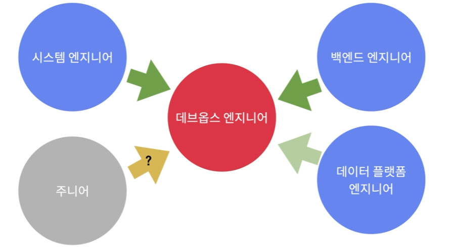
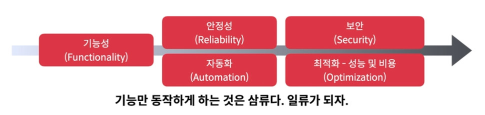
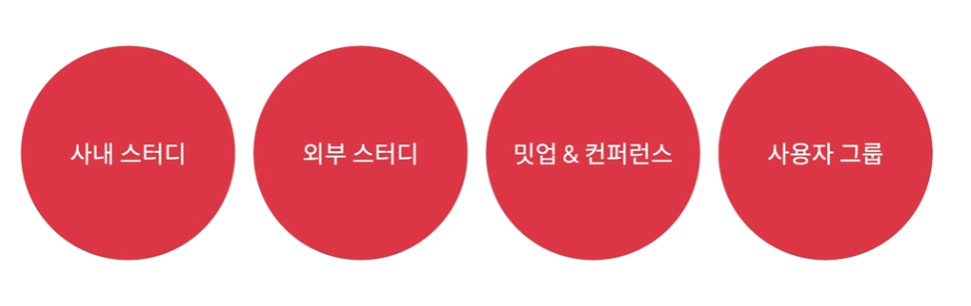

# DevOps 엔지니어 성장 전략

## 데브옵스 엔지니어 로드맵

* [DevOps Roadmap](https://roadmap.sh/devops)

1. 프로그래밍 언어 배우기
   * Go
2. 운영체제 개념 이해하기
   * 프로세스 관리(Process Management)
   * 스레드와 동시성(Threads and Concurrency)
   * 소켓(Sockets)
   * POSIX 기본(POSIX Basics)
   * 네트워킹 개념(Networking Concepts)
   * 시작 관리(Startup Management) - `init.d`
   * 서비스 관리(Service Management) - `systemd`
   * 입출력 관리(I/O Management)
   * 가상화(Virtualization)
   * 메모리/저장소(Memory/Storage)
   * 파일시스템(File Systems)
3. 서버 관리 배우기
   * 운영체제 - Linux 계열(Ubuntu, CentOS, RHEL)
   * 터미널 사용법 배우기
     * 터미널 멀티플렉서 - `tmux`
     * 스크립트 - `bash`
     * 에디터 - `vim`
     * 텍스트 조작 도구 - `awk`, `sed`, `grep`, `sort`, `uniq`, `cat`, `cut`, `echo`, `fmt`, `tr`, `nl`, `egrep`, `fgrep`, `wc`
     * 소스 빌드 - `gcc`, `make`
     * 프로세스 모니터링 - `ps`, `top`, `htop`, `atop`, `lsof`
     * 시스템 퍼포먼스 - `nmon`, `iostat`, `sar`, `vmstat`
     * 네트워크 - `nmap`, `tcpdump`, `ping`, `mtr`, `traceroute`, `dig`, `airmon`, `airodump`, `dig`, `iptables`, `netstat`
     * 기타 - `strace`, `dtrace`, `systemtap`, `uname`, `df`, `history`
4. 네트워킹, 보안과 프로토콜(Networking, Security and Protocols)
   * HTTP, HTTPS, FTP, SSL / TLS, SSH, 포트 포워딩(Port Forwarding)
   * 이메일 - SMTP, IMAPS, POP3S, DMARC, SPF, 도메인 키(Domain Keys)
5. 프록시 및 서버 구축
   * 포워드 프록시(Forward Proxy)
   * 리버스 프록시(Reverse Proxy)
   * 캐시 서버(Caching Server)
   * 로드 밸런서(Load Balancer)
   * 방화벽(Firewall)
   * 웹 서버(Web Server) - Nginx, Apache, Tomcat
6. IaC(Infrastructure as Code) 배우기
   * 컨테이너(Container) - Docker
   * 설정 관리(Configuration Management) - Ansible
   * 컨테이너 오케스트레이션(Container Orchestration) - Kubernetes
   * 인프라 구축(Infrastructure Provisioning) - Terraform
   * 서비스 매쉬(Service Mesh) - Istio, Envoy, Consul
7. CI / CD 도구 배우기
   * GitLab CI, GitHub Actions, Circle CI, Jenkins
8. 소프트웨어와 인프라 모니터링 배우기
   * 인프라 모니터링 - Prometheus, Grafana
   * 애플리케이션 모니터링 - Jaeger, New Relic
   * 로그 관리 - Elastic Stack, Loki
9. 클라우드 공급자(Cloud Providers)
   * AWS, GCP, Digital Ocean
10. 클라우드 디자인 패턴(Cloud Design Patterns)
    * 가용성(Availability)
    * 데이터 관리(Data Management)
    * 설계와 구현(Design and Implementation)
    * 관리와 모니터링(Management and Monitoring)

## 데브옵스 엔지니어 커리어

* 소프트웨어 개발 전 과정과 시스템 운영 전반에 대한 지식이 필요
* 시스템 엔지니어, 백엔드 엔지니어, 데이터 플랫폼 엔지니어에서 데브옵스 엔지니어로 커리어 전환하는 것을 추천

## 문제를 대하는 자세

### 다양한 고려사항

* 기능성(Functionality)
* 안정성(Reliability)
* 자동화(Automation)
* 보안(Security)
* 최적화 - 성능 및 비용(Optimization)

### 조언

* 기능성만 확보하는 것은 쉽다.
  * 우선 기능성 확보를 시작으로 조직의 우선순위에 따라 안정성, 자동화 등을 끊임없이 개선해 나가야 한다.
* 문제를 해결할 수 있는 방법은 많다.
  * 장기적으로 비전이 있는지, 생태계와 커뮤니티는 활성화되어 있는지 확인한 후 적합한 해결 방안을 채택하라.
* 장애가 발생하면 근본 원인(Root Cause)을 찾고, 장애 기록(Post-mortem)을 남기는 습관을 길러라.
* 조직에서 깊게 공부해 볼 문제 혹은 기술을 선택하여 시간 투자를 해 보아라.
* 모르는 것에 솔직해지고 동료에게 도움을 구하라.

## 함께 성장하기

* 혼자 학습하여 성장하는데는 한계가 있다.
* 잘하는 사람들이 가득한 환경으로 뛰어들어야 한다.

* 사내 스터디
* 외부 스터디
* 밋업 & 컨퍼런스
* 사용자 그룹

## 요약

* 데브옵스 로드맵을 통해 어떤 기술들과 도구를 익혀야 하는지 알아보았다.
* 데브옵스 엔지니어는 다른 전문성을 기반으로 시작하는 경우가 많다.
* 커리어의 첫 시작을 데브옵스 엔지니어로 하는 것이 불가능하지는 않지만 어렵다.
* 스터디나 컨퍼런스, 사용자 모임 등을 통해 다른 사람들과 함께 성장하자.
