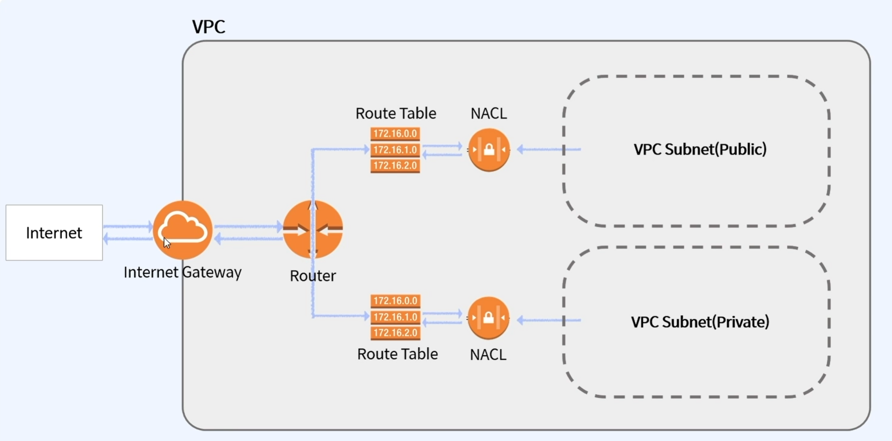
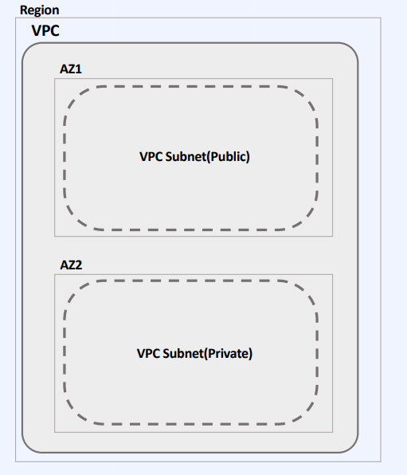
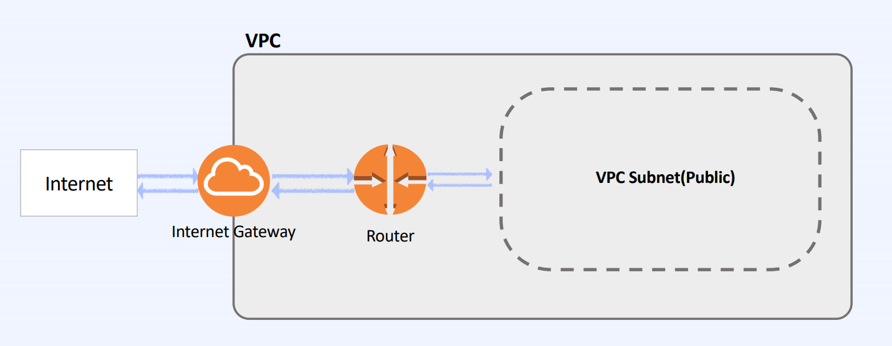
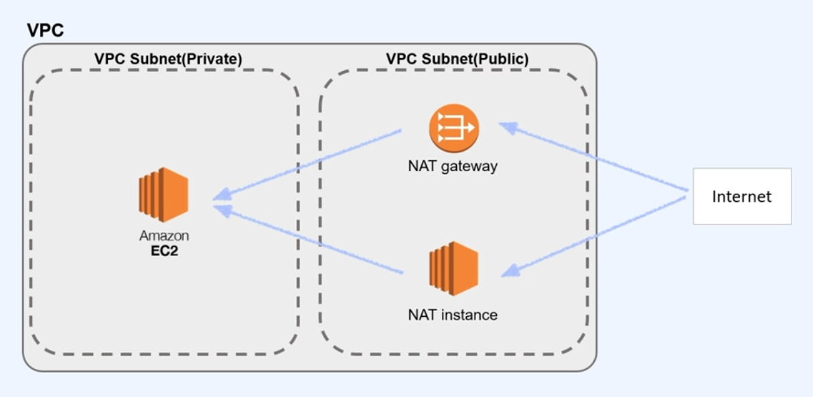
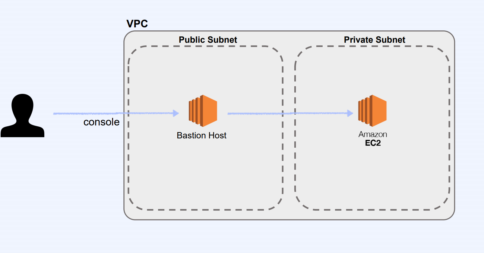
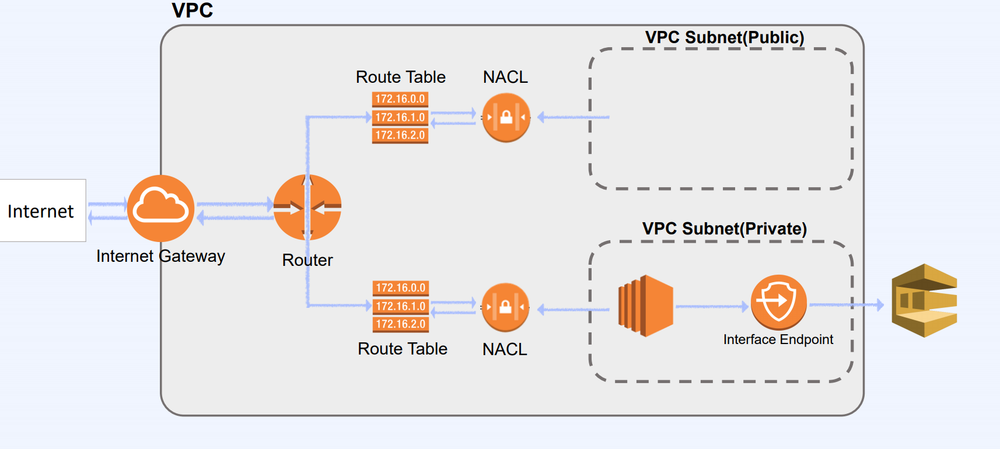
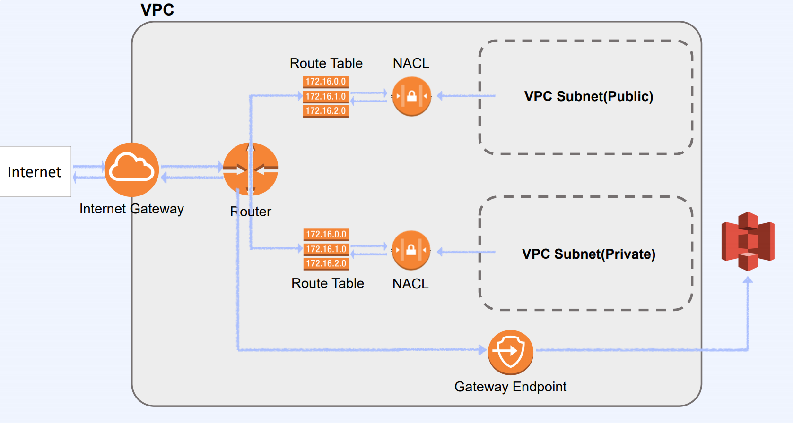

# AWS 기초와 VPC

## 클라우드 컴퓨팅(Cloud Computing)

### 장점

* 언제 어디서든 접근 가능
* 원하면 언제든지 컴퓨터 자원을 늘릴 수 있음
* 사용한 만큼만 지불하면 된다. (사용량 기반 과금)
* 초기비용이 적게 든다.
* 몇 분 만에 전 세계에 서비스 런칭할 수 있다.

### 단점

* 관리를 위해선 고급 전문 지식이 필요
* 파악하기 힘든 너무나 광범위한 서비스

## AWS의 주요 서비스

1. 컴퓨팅 서비스
2. 네트워킹 서비스
3. 스토리지 / 데이터베이스 서비스
4. 데이터 분석 / 인공지능 / 머신러닝 서비스

### 컴퓨팅 서비스

* **AWS EC2**: 사양과 크기를 조절할 수 있는 컴퓨팅 서비스
* **AWS Lightsail**: 가상화 프라이빗 서버
* **AWS Auto Scaling**: 서버의 특정 조건(ex. 트래픽)에 따라 서버를 추가/삭제할 수 있는 서비스
* **AWS Workspace**: 사내 PC를 가상화로 구성하여, 문서를 개인 PC에 보관하는 것이 아니라 서버에 보관하는 서비스

### 네트워킹 서비스

* **AWS Route 53**: DNS(Domain Name System) 웹 서비스
* **AWS VPC**: 가상 네트워크를 클라우드 내에 생성/구성
* **AWS Direct Connect**: 온프레미스 인프라와 AWS를 연결하는 네트워킹 서비스
* **AWS ELB**: 부하 분산(로드 밸런싱) 서비스

### 스토리지 / 데이터베이스 서비스

* **AWS S3**: 여러가지 파일을 형식에 구애 받지 않고 저장
* **AWS RDS**: 가상 SQL 데이터베이스 서비스
* **AWS DynamoDB**: 가상 NoSQL 데이터베이스 서비스
* **AWS ElastiCache**: In-memory 기반의 캐시 서비스

### 데이터 분석 / 인공지능 / 머신러닝 서비스

* **AWS Redshift**: 데이터 분석에 특화된 스토리지 시스템
* **AWS EMR**: 대량의 데이터를 효율적으로 가공 & 처리
* **AWS Sagemaker**: 머신 러닝 & 데이터 분석을 위한 클라우드 환경 제공

## 네트워킹의 기본

### IP 주소

* 컴퓨터 사이에 통신을 하려면 컴퓨터의 위치를 알아야 한다.
* 각 컴퓨터의 위치(주소)를 IP 주소라고 지칭한다. (IPv4)
* IP 주소는 32비트로 구성된다.
  * 8비트씩 끊어서 4개의 숫자로 표현하며, 각 8비트 단위를 옥텟이라고 부른다.
  * 사용 가능한 IP 주소의 총 개수 = 약 42억(2^32)개

### IPv4 클래스

* 첫 번째 옥텟의 앞자리 숫자로 클래스를 구분한다.
* IP 주소는 네트워크 비트(`#`)와 호스트 비트(`*`)로 나누어진다.
* IP 주소 대역의 첫 번째 IP를 네트워크 IP 주소라 한다.

#### A Class

```text
0#######.********.********.********
```

* 첫 번째 옥텟이 `0`으로 시작
* 2^7 개의 네트워크
* 네트워크 하나당 2^24 개의 호스트

#### B Class

```text
10######.########.********.********
```

* 첫 번째 옥텟이 `10`으로 시작
* 2^14 개의 네트워크
* 네트워크 하나당 2^16 개의 호스트

#### C Class

```text
110#####.########.########.********
```

* 첫 번째 옥텟이 `110`으로 시작
* 2^21 개의 네트워크
* 네트워크 하나당 2^8 개의 호스트

#### 예시

```text
211.11.124.2
11010011.00001011.01111100.00000010
```

* `110`으로 시작하므로 C 클래스에 해당
* 네트워크 주소: `211.11.124.0`
* IP 주소 범위: `211.11.124.0` ~ `211.11.124.255` (256개)

### 서브넷

* 클래스 기반으로 네트워크를 나누는 것은 비효율적이다.
* 서브넷이란 네트워크를 효율적으로 사용하기 위해 네트워크를 나누어 사용하는 것이다.
* **CIDR 표기법**: `네트워크 IP 주소/네트워크 비트 개수`로 표기한다.

#### 서브넷 예시 - 두 개로 나누기

* `211.11.124.0` 네트워크를 A, B 두 개의 서브넷으로 나누어보자.
* IP 주소 범위는 `211.11.124.0` ~ `211.11.124.255`이므로 다음과 같이 나눌 수 있다.
  * Subnet A = `211.11.124.0` ~ `211.11.124.127`
  * Subnet B = `211.11.124.128` ~ `211.11.124.255`
* 이를 CIDR 표기법으로 표현하면 다음과 같다.
  * Subnet A = `211.11.124.0/25`
  * Subnet B = `211.11.124.128/25`

#### 서브넷 예시 - 네 개로 나누기

* `211.11.124.0` 네트워크를 A, B, C, D 네 개의 서브넷으로 나누어보자.
* IP 주소 범위는 `211.11.124.0` ~ `211.11.124.255`이므로 다음과 같이 나눌 수 있다.
  * Subnet A = `211.11.124.0` ~ `211.11.124.63`
  * Subnet B = `211.11.124.64` ~ `211.11.124.127`
  * Subnet C = `211.11.124.128` ~ `211.11.124.191`
  * Subnet D = `211.11.124.192` ~ `211.11.124.255`
* 이를 CIDR 표기법으로 표현하면 다음과 같다.
  * Subnet A = `211.11.124.0/26`
  * Subnet B = `211.11.124.64/26`
  * Subnet B = `211.11.124.128/26`
  * Subnet B = `211.11.124.192/26`

## VPC

### Amazon VPC

* **VPC**: Virtual Private Cloud
* Amazon VPC를 이용하면 사용자가 정의한 가상 네트워크로 AWS 리소스를 시작할 수 있다.
* AWS 계층구조: Region > VPC > AZ > VPC Subnet

### Amazon VPC의 특징

* 계정 생성 시 default로 VPC를 만들어준다.
* EC2, RDS, S3 등의 서비스 활용 가능
* 서브넷 구성
* 보안 설정 (IP Block, InBound/OutBound)
* VPC Peering(VPC 간 연결)
* IP 대역 지정 가능
* VPC는 하나의 리전에만 속할 수 있다. (다른 리전으로 확장 불가)

### VPC의 구성요소



#### AZ(Availability Zone)

* 물리적으로 분리되어 있는 인프라가 모여 있는 데이터 센터
* 각 AZ는 일정 거리 이상 떨어져 있음
* 하나의 리전은 2개 이상의 AZ로 구성됨

#### VPC Subnet



* VPC의 하위 단위
* 하나의 AZ에서만 생성 가능
* 하나의 AZ에는 여러 개의 서브넷 생성 가능
* Private Subnet: 인터넷에 접근 불가능한 서브넷
* Public Subnet: 인터넷에 접근 가능한 서브넷
* CIDR 블록을 통해 서브넷을 구분

#### IGW(Internet Gateway)



* 외부 인터넷과 소통하기 위한 통로
* Private Subnet은 IGW로 연결되어 있지 않다.

#### NACL(Network Access Control List) / SG(Security Group)

* 보안 검문소
* NACL: Stateless / SG: Stateful
* Access Block은 NACL에서만 가능

#### Route Table

* 트래픽이 어디로 가야 할 지 알려주는 테이블
* VPC 생성시 자동으로 만들어준다.

#### NAT(Network Address Translation) Instance / Gateway



* Private Subnet 안에 있는 Private Instance가 외부의 인터넷과 통신하기 위한 방법
* NAT Instance는 단일 인스턴스(EC2), NAT Gateway는 AWS에서 제공하는 서비스
* NAT Instance는 Public Subnet에 있어야 한다.



* **Bastion Host**: 관리자가 인터넷으로 Private Subnet의 인스턴스에 접근하기 위한 수단.

#### VPC endpoint

* AWS의 여러 서비스들과 VPC를 연결시켜주는 중간 매개체
  * VPC 인스턴스는 퍼블릭 IP 주소 없이도 VPC 엔드포인트를 통해 AWS 서비스 및 VPC 엔드포인트 서비스에 비공개로 연결할 수 있다.
  * AWS에서 VPC 바깥으로 트래픽이 나가지 않고 AWS의 여러 서비스를 사용할 수 있다.
  * Private Subnet과 같은 격리된 공간에서도 AWS의 다양한 서비스들에 연결할 수 있다.



* **Interface Endpoint**: Private IP를 만들어 서비스로 연결해준다. (SQS, SNS, Kinesis, Sagemaker 등)



* **Gateway Endpoint**: 라우팅 테이블에서 경로의 대상으로 지정하여 사용한다. (S3, DynamoDB 등)
